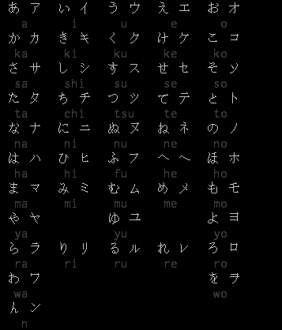
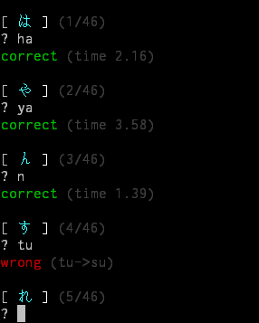
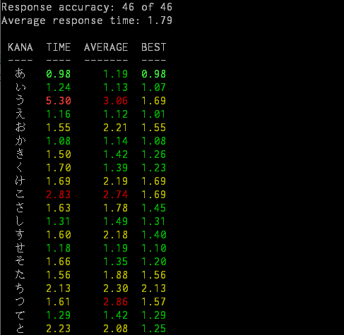

# KanaQuiz

Can you name the Romaji (English syllable) that matches the Hiragana/Katakana character ?

## Requirements

- Python 3.5+

## Usage

```bash
usage python3 kanaquiz.py <operation>
operations: 
    python3 kanaquiz.py {-h}     play hiragana only
    python3 kanaquiz.py {-k}     play katakana only
    python3 kanaquiz.py {-a}     play all kana quiz
    python3 kanaquiz.py {-d}     play dakuon quiz
    python3 kanaquiz.py {-t}     play trinity quiz
    python3 kanaquiz.py {-l}     list kanas with romaji
    python3 kanaquiz.py {-o}     list kanas only
    python3 kanaquiz.py {-q}     query performance history
```

## Tutorial

List all the hiragana/katakana characters and their romanized names:

```bash
python3 kanaquiz.py -l
```

Study/review kanas right inside your terminal: 



When you are ready, take the hiragana quiz at first:

```bash
python3 kanaquiz.py -h
```

click enter to start the quiz:

```
[ よ ]  (1/46)
 ? {cursor}
```

Read the kana character in the square brackets `[ ]` and input its romanized name after the question mark `?` then press Enter to continue.

example:



You can get a nice performance report after finished:



The history reports can always be queried by:

```bash
python3 kanaquiz.py -q
```

Check the hiragana/katakana chart at any time if you can't remember them by:

```bash
python3 kanaquiz.py -l
```


## Credit

- Twitter: [@skywind3000](https://twitter.com/skywind3000)
